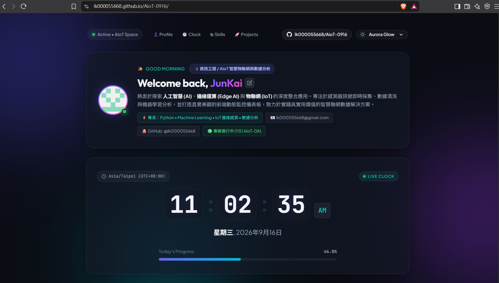

# JunKai's Personal Space (AIoT-0916)

A modern, glassmorphic personal portfolio dashboard crafted for the **1151 AIoT & Data Analysis (AIoT-DA)** course.

- 🌐 **Live Website (GitHub Pages)**: [https://lk000055668.github.io/AioT-0916/](https://lk000055668.github.io/AioT-0916/)
- 🔗 **GitHub Repository**: [https://github.com/lk000055668/AioT-0916](https://github.com/lk000055668/AioT-0916)

---

## 📸 Preview



---

## 📋 Course Requirements Checklist (課程五大要求)

| 項次 | 要求項目 | 內容與實作 | 狀態 |
| :--- | :--- | :--- | :---: |
| 👤 **1** | **Profile (個人簡介)** | 姓名 (JunKai)、個人 Avatar/照片、科系/專長 (資訊工程 / AIoT & Data Analysis)、簡短自我介紹與聯絡資訊 | ✅ 完成 |
| 🛠 **2** | **Skills (專業技能)** | 列出 6 項核心技術：Python、AI & Machine Learning、IoT & Embedded、Data Analysis、Web Development、Git & GitHub | ✅ 完成 |
| 🚀 **3** | **Projects (專案作品)** | 包含「AIoT 智慧環境監測與即時數據分析平台」(本學期專案) 及「個人專屬儀表板與即時時鐘」，附技術棧與 GitHub 連結 | ✅ 完成 |
| 🕐 **4** | **Live Clock (即時時鐘)** | JavaScript 即時數字時鐘 (HH : MM : SS)、AM/PM、時區 (UTC+08:00)、日期與今日進度條，每秒精準自動更新 | ✅ 完成 |
| 🎨 **5** | **Personal Design (個人風格)** | 獨創深色毛玻璃擬態 (Dark Glassmorphism)、環境極光光暈動畫、三套切換主題 (Aurora / Cyber / Slate)、Google Fonts 字型體系 | ✅ 完成 |

---

## 🛠 Features & Technology Stack

- 🕒 **High-Precision Live Clock**: 12-hour digital clock with animated blink colons, AM/PM tag, and live timezone synchronization.
- 🌅 **Temporal Greeting**: Time-aware dynamic greeting messages (Morning, Afternoon, Evening, Night).
- 📊 **Day Progress Indicator**: Visual progress bar dynamically calculating real-time percentage of the day completed.
- 🎨 **Theme Engine**: 3 tailored color themes (`Aurora Glow`, `Cyber Neon`, `Midnight Slate`) stored in `localStorage`.
- ✍️ **Interactive Name Editing**: Click to customize display name on the fly.
- 🐙 **GitHub REST API Sync**: Fetches real-time repository visibility, sync status, and direct GitHub Pages link.

---

## 📂 Project Structure

```
├── index.html       # Semantic HTML5 layout (Profile, Skills, Projects, Live Clock)
├── style.css        # Responsive Glassmorphism design system & multi-theme variables
├── app.js           # Live clock engine, dynamic greetings, theme switcher & GitHub API sync
└── README.md        # Comprehensive project documentation & coursework checklist
```

---

## 🚀 Syncing & Deploying to GitHub Pages

1. **Push your code to GitHub**:
   ```bash
   git push -u origin main
   ```
2. **Enable GitHub Pages**:
   - Go to [Repository Settings → Pages](https://github.com/lk000055668/AioT-0916/settings/pages).
   - Under **Build and deployment** > **Source**, choose **Deploy from a branch**.
   - Select Branch: `main` and Folder: `/(root)`.
   - Click **Save**. Your site will be published at [https://lk000055668.github.io/AioT-0916/](https://lk000055668.github.io/AioT-0916/).